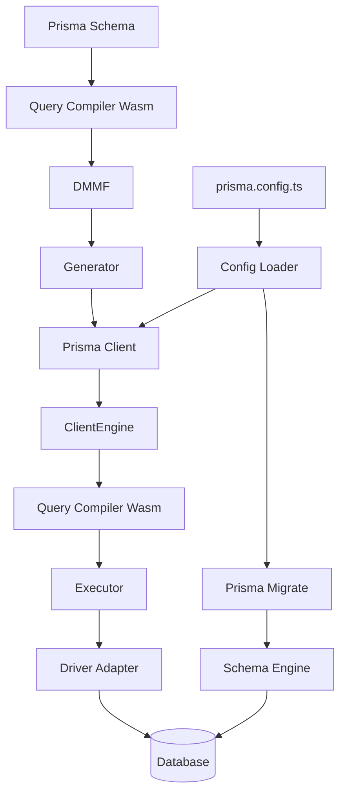

Prisma ORM is a next-generation ORM built on a modern, modular architecture that separates concerns across multiple components. This guide explains how these components work together.

## Core Components

Prisma ORM consists of several key components:

- **Prisma Client**: Auto-generated, type-safe query builder
- **Prisma Schema**: Declarative data modeling language (PSL)
- **Prisma Config**: TypeScript-based configuration system
- **Prisma Migrate**: Declarative database migration system
- **Query Compiler**: WebAssembly-based query planner and compiler
- **Driver Adapters**: JavaScript database driver integration layer

## Prisma Client

Prisma Client is an auto-generated query builder that provides type-safe database access. It's generated based on your Prisma schema and can be used in any Node.js or TypeScript backend.

### Client Engine Architecture

The Client Engine (`ClientEngine`) orchestrates query execution using a WebAssembly-based query compiler:

```typescript
// From packages/client/src/runtime/core/engines/client/ClientEngine.ts
export class ClientEngine implements Engine {
  name = 'ClientEngine' as const
  
  // Engine can be in different states:
  // - disconnected
  // - connecting
  // - connected
  // - disconnecting
}
```

### Query Execution Flow

Queries flow through the following components:

1. **PrismaClient** - User-facing API
2. **ClientEngine.request()** - Request handling
3. **Query Compiler** - Query planning (WebAssembly)
4. **Executor.execute()** - Query execution
5. **QueryInterpreter.run()** - Execution against driver adapter
6. **Driver Adapter** - Database communication

<Note>
Prisma 7 uses JavaScript drivers via driver adapters instead of native binaries. The query compiler and PSL parser are compiled to WebAssembly for maximum portability.
</Note>

### Executor Types

Prisma Client supports two execution modes:

#### Local Executor

Used for direct database connections via driver adapters:

```typescript
// LocalExecutor handles direct connections
type LocalExecutorConfig = {
  remote: false
  driverAdapterFactory: SqlDriverAdapterFactory
}
```

#### Remote Executor

Used for Prisma Accelerate and Data Proxy connections:

```typescript
// RemoteExecutor handles Accelerate/Data Proxy
type RemoteExecutorConfig = {
  remote: true
  accelerateUrl: string
}
```

## Query Compiler

The Query Compiler is a Rust component compiled to WebAssembly that handles:

- **Query Planning**: Converting Prisma operations to SQL
- **Query Optimization**: Optimizing query execution plans
- **Type Validation**: Ensuring type safety at runtime

### Query Plan Cache

Prisma uses a query plan cache to avoid recompiling identical queries:

```typescript
import { QueryPlanCache } from './query-plan-cache'

// Queries are cached by their structure
const cache = new QueryPlanCache()
```

## Driver Adapters

Driver adapters enable Prisma to work with JavaScript database drivers. Available adapters:

- `@prisma/adapter-pg` - PostgreSQL (node-postgres)
- `@prisma/adapter-neon` - Neon serverless PostgreSQL
- `@prisma/adapter-libsql` - libSQL/Turso
- `@prisma/adapter-planetscale` - PlanetScale serverless
- `@prisma/adapter-d1` - Cloudflare D1
- `@prisma/adapter-better-sqlite3` - better-sqlite3
- `@prisma/adapter-mssql` - Microsoft SQL Server
- `@prisma/adapter-mariadb` - MariaDB
- `@prisma/adapter-ppg` - Prisma Postgres Serverless

### Driver Adapter Interface

All adapters implement the `SqlDriverAdapter` interface:

```typescript
interface SqlDriverAdapter {
  // Execute a query and return results
  queryRaw(query: SqlQuery): Promise<Result<SqlResultSet>>
  
  // Execute a query without returning results
  executeRaw(query: SqlQuery): Promise<Result<number>>
  
  // Start a transaction
  startTransaction(): Promise<Result<Transaction>>
  
  // Get connection info
  getConnectionInfo(): Result<ConnectionInfo>
}
```

### Using Driver Adapters

```typescript
import { PrismaClient } from '@prisma/client'
import { PrismaPg } from '@prisma/adapter-pg'
import { Pool } from 'pg'

const pool = new Pool({ connectionString: process.env.DATABASE_URL })
const adapter = new PrismaPg(pool)

const prisma = new PrismaClient({ adapter })
```

## Prisma Migrate

Prisma Migrate is a declarative migration system that:

- Generates migration files based on schema changes
- Applies migrations to your database
- Tracks migration history
- Supports shadow databases for validation

### Schema Engine

Migrate uses a Schema Engine (native binary) to:

- Introspect databases
- Generate migration SQL
- Validate schema changes
- Apply migrations

The Schema Engine is separate from the query execution engine and is only used during development and deployment.

## DMMF (Data Model Meta Format)

The DMMF is an AST (Abstract Syntax Tree) representation of your Prisma schema in JSON format:

<Warning>
The DMMF is an internal API with no stability guarantees. It may change between minor versions.
</Warning>

```typescript
// DMMF structure
interface DMMF {
  datamodel: {
    models: Model[]
    enums: Enum[]
    types: ModelType[]
  }
  schema: {
    inputObjectTypes: InputType[]
    outputObjectTypes: OutputType[]
    enumTypes: EnumType[]
  }
  mappings: {
    modelOperations: ModelMapping[]
  }
}
```

The entire Prisma Client is generated based on the DMMF, which comes from the Rust query compiler.

## Generator System

Prisma uses a generator system to create the client. Generators receive the DMMF and produce code:

```typescript
import { generatorHandler } from '@prisma/generator-helper'

generatorHandler({
  onManifest: () => ({
    defaultOutput: './generated/client',
    prettyName: 'Prisma Client',
  }),
  onGenerate: async (options) => {
    // Generate client code based on options.dmmf
  },
})
```

## Component Communication



## Key Architecture Principles

### Type Safety

Prisma's architecture ensures type safety from schema to runtime:

- Schema types are validated at generation time
- Client types are generated from DMMF
- Runtime validation ensures data consistency

### Performance

Optimizations throughout the stack:

- Query plan caching
- WebAssembly compilation for fast query planning
- Direct driver integration (no binary engines)
- Connection pooling via driver adapters

### Portability

Prisma works across environments:

- WebAssembly for cross-platform support
- JavaScript drivers for edge runtime compatibility
- No native dependencies in Prisma Client

## Package Structure

The monorepo contains specialized packages:

| Package | Purpose |
|---------|----------|
| `@prisma/client` | Client runtime |
| `@prisma/client-common` | Shared client utilities |
| `@prisma/client-engine-runtime` | Query interpreter and transaction manager |
| `@prisma/client-generator-js` | Traditional generator (prisma-client-js) |
| `@prisma/client-generator-ts` | New TypeScript generator (prisma-client) |
| `@prisma/config` | Configuration system |
| `@prisma/migrate` | Migration commands |
| `@prisma/internals` | Shared CLI utilities |
| `@prisma/driver-adapter-utils` | Driver adapter interfaces |
| `@prisma/adapter-*` | Database-specific adapters |

## Next Steps

<CardGroup cols={2}>
  <Card title="Prisma Schema" icon="code" href="/concepts/schema">
    Learn about the Prisma Schema Language
  </Card>
  <Card title="Prisma Config" icon="gear" href="/concepts/prisma-config">
    Configure Prisma with TypeScript
  </Card>
  <Card title="Data Model" icon="database" href="/concepts/data-model">
    Understand data modeling concepts
  </Card>
  <Card title="Generators" icon="wand-magic-sparkles" href="/concepts/generators">
    Explore the generator system
  </Card>
</CardGroup>