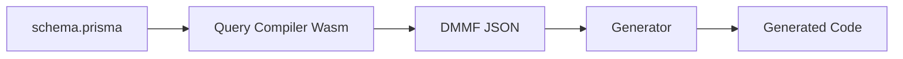

Prisma's generator system transforms your Prisma schema into usable code. This guide explains how generators work, the available options, and how to create custom generators.

## What are Generators?

Generators are programs that read your Prisma schema and produce code or other artifacts. The most common generator is Prisma Client, but you can also create custom generators for documentation, GraphQL schemas, mock data, and more.

## Generator Block

Generators are defined in your Prisma schema:

```prisma schema.prisma
generator client {
  provider = "prisma-client"
  output   = "./generated/client"
}

model User {
  id    Int    @id @default(autoincrement())
  email String @unique
}
```

### Generator Options

<Accordion title="Common Generator Options">

| Option | Description | Default |
|--------|-------------|----------|
| `provider` | Generator package or path | Required |
| `output` | Output directory | `node_modules/.prisma/client` |
| `previewFeatures` | Enable preview features | `[]` |
| `binaryTargets` | Build targets for engines | Auto-detected |
| `engineType` | Engine type (library/binary) | `library` |

</Accordion>

## Official Generators

### prisma-client (New Generator)

The new TypeScript-based generator for Prisma 7:

```prisma
generator client {
  provider = "prisma-client"
  output   = "./generated/client"
}
```

Features:
- Full TypeScript types
- Optimized code generation
- Smaller bundle size
- Better performance

Location: `packages/client-generator-ts`

### prisma-client-js (Legacy Generator)

The traditional JavaScript generator (still supported):

```prisma
generator client {
  provider = "prisma-client-js"
  output   = "@prisma/client"
}
```

Location: `packages/client-generator-js`

<Note>
Both generators are currently supported. The new `prisma-client` generator will become the default in future versions.
</Note>

## How Generators Work

### 1. Schema Parsing

Prisma parses your schema into DMMF (Data Model Meta Format):



### 2. Generator Protocol

Generators communicate via JSON-RPC over stdin/stdout:

```typescript
import { generatorHandler } from '@prisma/generator-helper'

generatorHandler({
  onManifest: () => ({
    defaultOutput: './generated',
    prettyName: 'My Generator',
    requiresGenerators: ['prisma-client-js'],
  }),
  onGenerate: async (options) => {
    // Access the DMMF
    const { dmmf, datamodel, datasources, generator } = options
    
    // Generate code based on DMMF
    // ...
  },
})
```

### 3. DMMF Structure

The Data Model Meta Format is the AST of your schema:

```typescript
interface DMMF {
  datamodel: {
    models: Model[]
    enums: Enum[]
    types: Type[]
  }
  schema: {
    inputObjectTypes: InputType[]
    outputObjectTypes: OutputType[]
    enumTypes: EnumType[]
  }
  mappings: {
    modelOperations: ModelMapping[]
  }
}
```

<Warning>
The DMMF is an internal API with no stability guarantees. It may change between minor versions.
</Warning>

#### Example DMMF for a Model

```json
{
  "datamodel": {
    "models": [
      {
        "name": "User",
        "dbName": null,
        "fields": [
          {
            "name": "id",
            "kind": "scalar",
            "type": "Int",
            "isRequired": true,
            "isList": false,
            "isId": true,
            "isUnique": false,
            "default": { "name": "autoincrement", "args": [] }
          },
          {
            "name": "email",
            "kind": "scalar",
            "type": "String",
            "isRequired": true,
            "isList": false,
            "isUnique": true
          },
          {
            "name": "posts",
            "kind": "object",
            "type": "Post",
            "relationName": "PostToUser",
            "isList": true
          }
        ]
      }
    ]
  }
}
```

## Creating Custom Generators

### 1. Setup

Create a new package:

```json package.json
{
  "name": "prisma-generator-docs",
  "version": "1.0.0",
  "main": "dist/generator.js",
  "bin": {
    "prisma-generator-docs": "dist/generator.js"
  },
  "dependencies": {
    "@prisma/generator-helper": "latest"
  }
}
```

### 2. Implement Generator

```typescript src/generator.ts
import { generatorHandler, GeneratorOptions } from '@prisma/generator-helper'
import { writeFileSync } from 'fs'
import { join } from 'path'

generatorHandler({
  onManifest() {
    return {
      defaultOutput: './generated/docs',
      prettyName: 'Prisma Documentation Generator',
    }
  },
  
  async onGenerate(options: GeneratorOptions) {
    const { dmmf, generator } = options
    const outputDir = generator.output?.value || './generated/docs'
    
    // Generate documentation for each model
    for (const model of dmmf.datamodel.models) {
      const markdown = generateModelDocs(model)
      const filePath = join(outputDir, `${model.name}.md`)
      writeFileSync(filePath, markdown)
    }
  },
})

function generateModelDocs(model: any): string {
  return `
# ${model.name}

## Fields

${model.fields.map((field: any) => 
  `- **${field.name}**: ${field.type} ${field.isRequired ? '(required)' : '(optional)'}\n`
).join('')}
  `.trim()
}
```

### 3. Use in Schema

```prisma schema.prisma
generator docs {
  provider = "prisma-generator-docs"
  output   = "./docs/models"
}

model User {
  id    Int    @id @default(autoincrement())
  email String @unique
  posts Post[]
}

model Post {
  id       Int    @id @default(autoincrement())
  title    String
  author   User   @relation(fields: [authorId], references: [id])
  authorId Int
}
```

### 4. Run Generation

```bash
prisma generate
```

This will create:
- `docs/models/User.md`
- `docs/models/Post.md`

## Real-World Custom Generator Example

Here's a more complete generator that creates TypeScript type guards:

```typescript
import { generatorHandler, GeneratorOptions } from '@prisma/generator-helper'
import { writeFileSync, mkdirSync } from 'fs'
import { join } from 'path'

generatorHandler({
  onManifest() {
    return {
      defaultOutput: './generated/guards',
      prettyName: 'Type Guard Generator',
      requiresGenerators: ['prisma-client-js'],
    }
  },
  
  async onGenerate(options: GeneratorOptions) {
    const { dmmf, generator } = options
    const outputDir = generator.output?.value || './generated/guards'
    
    // Ensure output directory exists
    mkdirSync(outputDir, { recursive: true })
    
    // Generate guards file
    const guards = generateGuards(dmmf.datamodel.models)
    writeFileSync(join(outputDir, 'index.ts'), guards)
  },
})

function generateGuards(models: any[]): string {
  const imports = `import { Prisma } from '@prisma/client'\n\n`
  
  const guards = models.map(model => {
    const fields = model.fields
      .filter((f: any) => f.kind === 'scalar')
      .map((f: any) => {
        const check = getTypeCheck(f.type, f.name)
        return `  if (${check}) return false`
      })
      .join('\n')
    
    return `
export function is${model.name}(obj: unknown): obj is Prisma.${model.name} {
  if (typeof obj !== 'object' || obj === null) return false
  const data = obj as Record<string, unknown>
${fields}
  return true
}
    `.trim()
  }).join('\n\n')
  
  return imports + guards
}

function getTypeCheck(type: string, fieldName: string): string {
  switch (type) {
    case 'String':
      return `typeof data.${fieldName} !== 'string'`
    case 'Int':
    case 'BigInt':
    case 'Float':
    case 'Decimal':
      return `typeof data.${fieldName} !== 'number'`
    case 'Boolean':
      return `typeof data.${fieldName} !== 'boolean'`
    case 'DateTime':
      return `!(data.${fieldName} instanceof Date)`
    default:
      return `!data.${fieldName}`
  }
}
```

## Generator Options API

The `GeneratorOptions` object provides:

```typescript
interface GeneratorOptions {
  // The DMMF representation of your schema
  dmmf: DMMF.Document
  
  // Raw schema as string
  datamodel: string
  
  // Datasource configurations
  datasources: DataSource[]
  
  // Generator configuration from schema
  generator: {
    name: string
    provider: { value: string }
    output?: { value: string }
    config: Record<string, string>
    previewFeatures: string[]
  }
  
  // Other generators in schema
  otherGenerators: Generator[]
  
  // Schema path
  schemaPath: string
  
  // Prisma version
  version: string
}
```

## Generator Registry

Prisma maintains a registry of known generators in `packages/client-generator-registry`:

```typescript
// From packages/client-generator-registry
export const KNOWN_GENERATORS = {
  'prisma-client-js': {
    name: 'Prisma Client JS',
    description: 'Type-safe database client for JavaScript & TypeScript',
  },
  'prisma-client': {
    name: 'Prisma Client',
    description: 'New TypeScript-based Prisma Client generator',
  },
}
```

## Multiple Generators

You can run multiple generators:

```prisma
generator client {
  provider = "prisma-client"
}

generator docs {
  provider = "prisma-docs-generator"
  output   = "./docs"
}

generator graphql {
  provider = "typegraphql-prisma"
  output   = "./generated/graphql"
}
```

All generators run when you execute:

```bash
prisma generate
```

## Preview Features

Enable experimental features:

```prisma
generator client {
  provider        = "prisma-client"
  previewFeatures = ["fullTextSearch", "metrics"]
}
```

Preview features are beta functionality that may change.

## Binary Targets

For deployment to different platforms:

```prisma
generator client {
  provider      = "prisma-client"
  binaryTargets = ["native", "rhel-openssl-1.0.x", "debian-openssl-3.0.x"]
}
```

Available targets:
- `native` - Current platform
- `debian-openssl-1.1.x` - Debian/Ubuntu with OpenSSL 1.1
- `debian-openssl-3.0.x` - Debian/Ubuntu with OpenSSL 3.0
- `rhel-openssl-1.0.x` - RHEL/CentOS with OpenSSL 1.0
- `linux-musl` - Alpine Linux
- `darwin` - macOS
- `windows` - Windows

## Generator Best Practices

### 1. Validate Input

```typescript
async onGenerate(options: GeneratorOptions) {
  const { generator } = options
  
  if (!generator.output) {
    throw new Error('Output path is required')
  }
  
  // Validate custom config
  if (generator.config.format && !['json', 'yaml'].includes(generator.config.format)) {
    throw new Error('Invalid format. Must be json or yaml')
  }
}
```

### 2. Handle Errors Gracefully

```typescript
async onGenerate(options: GeneratorOptions) {
  try {
    // Generation logic
  } catch (error) {
    console.error('Generation failed:', error)
    throw error // Re-throw to fail the generation
  }
}
```

### 3. Use TypeScript Builders

Prisma provides `@prisma/ts-builders` for generating TypeScript code:

```typescript
import { Writers } from '@prisma/ts-builders'

const file = Writers.namedType('User')
  .addProperty('id', Writers.namedType('number'))
  .addProperty('email', Writers.namedType('string'))
  .write()
```

### 4. Provide Helpful Output

```typescript
async onGenerate(options: GeneratorOptions) {
  console.log(`Generating documentation for ${options.dmmf.datamodel.models.length} models...`)
  
  // ... generation logic
  
  console.log(`✓ Generated files in ${generator.output?.value}`)
}
```

## Community Generators

Popular community generators:

- **Nexus Prisma** - GraphQL schema generation
- **typegraphql-prisma** - TypeGraphQL integration
- **prisma-dbml-generator** - DBML diagram generation
- **prisma-json-schema-generator** - JSON Schema generation
- **prisma-docs-generator** - Markdown documentation

## Next Steps

<CardGroup cols={2}>
  <Card title="Prisma Schema" icon="code" href="/concepts/schema">
    Learn schema syntax
  </Card>
  <Card title="Architecture" icon="sitemap" href="/concepts/architecture">
    Understand generator architecture
  </Card>
  <Card title="DMMF Reference" icon="book" href="/reference/dmmf">
    DMMF structure reference
  </Card>
  <Card title="Custom Generator Tutorial" icon="wand-magic-sparkles" href="/guides/custom-generator">
    Build your first generator
  </Card>
</CardGroup>